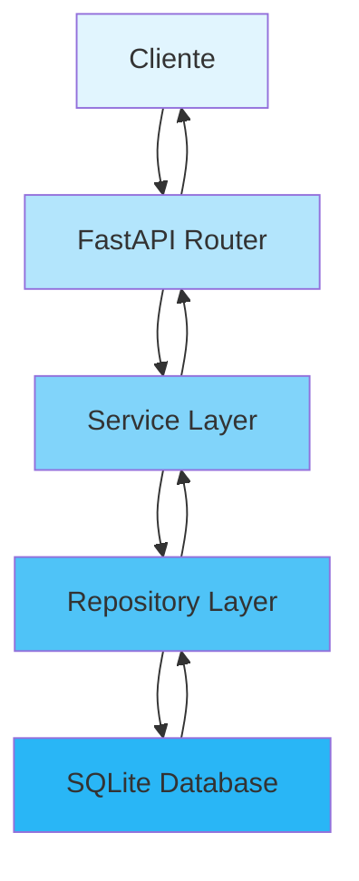
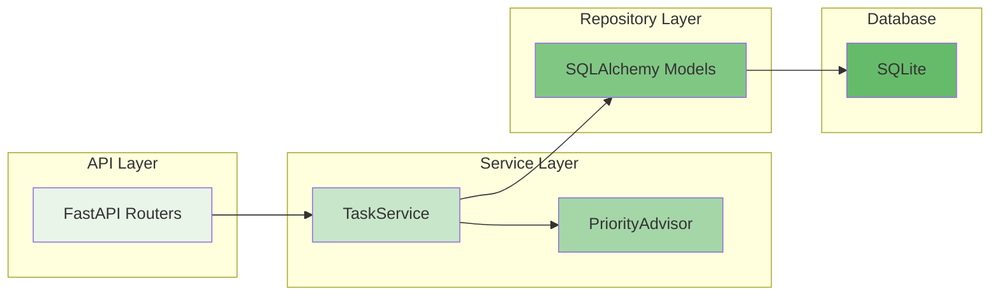

# Diagramas de Arquitetura — laboratorio-taskapi

Este documento contém diagramas Mermaid representando a arquitetura do sistema FastAPI com camadas API, Service, Repository e o componente PriorityAdvisor.

## Diagrama de Fluxo de Dados

O diagrama abaixo ilustra o caminho de uma requisição HTTP desde o cliente até o banco de dados SQLite, passando pelas camadas da aplicação.

### Lógica de Persistência
A lógica de persistência segue o padrão Repository: a camada Service coordena a lógica de negócio e delega operações de dados à Repository Layer, que utiliza SQLAlchemy para interagir com o SQLite. Dados são validados na entrada (API Layer via Pydantic), processados na Service Layer, persistidos na Repository Layer e retornados ao cliente. O PriorityAdvisor pode ser integrado na Service Layer para sugerir prioridades baseadas em regras de negócio.

## Diagrama de Componentes

O diagrama de componentes mostra as principais camadas e o componente PriorityAdvisor.

