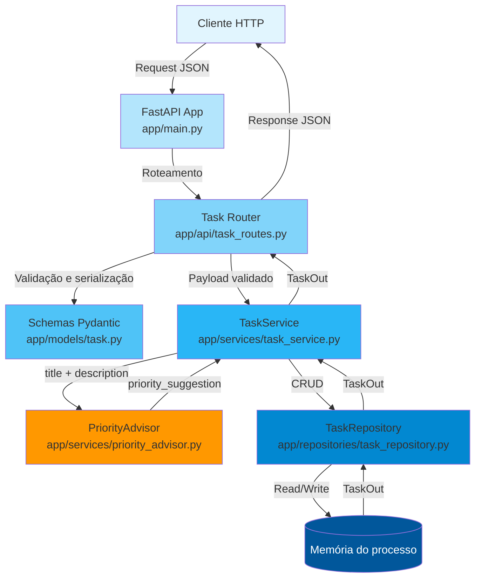
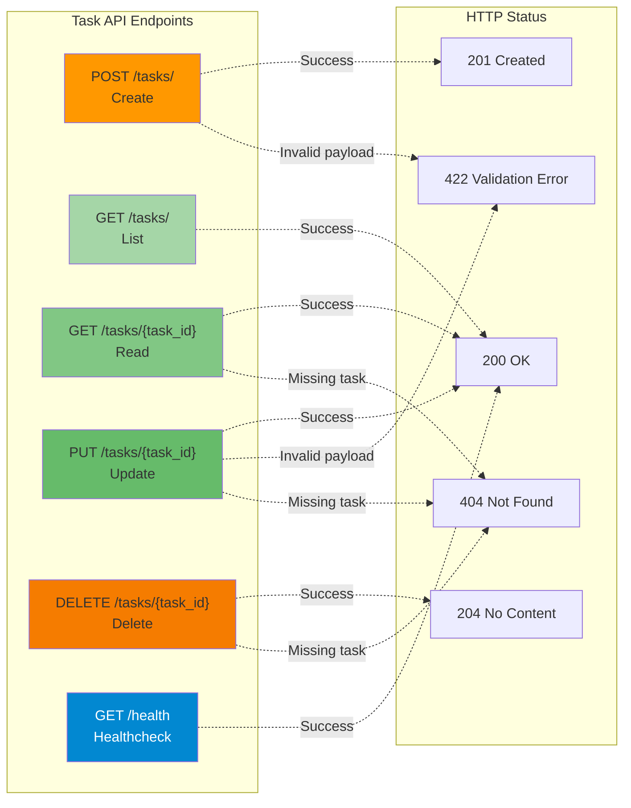
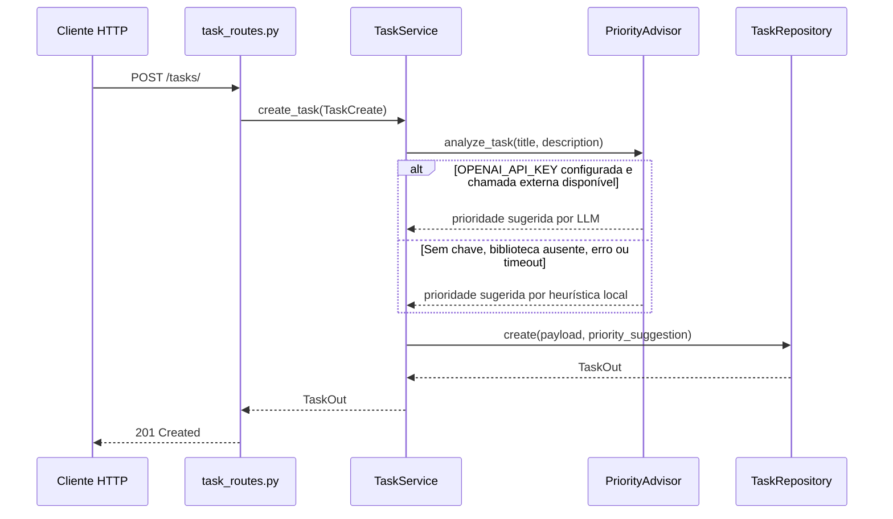

# Diagramas de Arquitetura — laboratorio-taskapi

Este documento contém diagramas Mermaid da arquitetura atual do MVP: uma API FastAPI de tarefas com repositório em memória e sugestão de prioridade via `PriorityAdvisor`.

## Fluxo de Dados

O diagrama abaixo mostra o caminho de uma requisição HTTP desde o cliente até o repositório em memória.



### Etapas

1. O cliente envia uma requisição HTTP para a API.
2. `app/main.py` recebe a requisição e encaminha para o router registrado.
3. `app/api/task_routes.py` valida entrada e saída usando schemas Pydantic.
4. `TaskService` orquestra a regra de negócio.
5. `PriorityAdvisor` sugere prioridade ao criar tarefa ou ao atualizar título/descrição.
6. `TaskRepository` grava, consulta, atualiza ou remove tarefas em memória.
7. A resposta retorna ao cliente como JSON.

## Diagrama de Componentes

```mermaid
graph TB
    subgraph "Cliente"
        CLI["HTTP Client<br/>(curl, Postman, TestClient)"]
    end

    subgraph "FastAPI Application"
        APP["main.py<br/>(FastAPI app)"]
        ROUTER["api/task_routes.py<br/>(Task endpoints)"]
    end

    subgraph "Domain Models"
        MODELS["models/task.py<br/>(Enums + Pydantic schemas)"]
    end

    subgraph "Service Layer"
        SVC["services/task_service.py<br/>(TaskService)"]
        PA["services/priority_advisor.py<br/>(PriorityAdvisor)"]
    end

    subgraph "Repository Layer"
        REPO["repositories/task_repository.py<br/>(TaskRepository)"]
        STORE[("In-memory storage<br/>dict[int, TaskOut]")]
    end

    CLI -->|HTTP Request| APP
    APP -->|include_router| ROUTER
    ROUTER -->|Validates request/response| MODELS
    ROUTER -->|Calls service| SVC
    SVC -->|Suggest priority| PA
    PA -->|Priority| SVC
    SVC -->|CRUD operations| REPO
    REPO -->|Read/Write| STORE
    STORE -->|TaskOut| REPO
    REPO -->|TaskOut/list[TaskOut]| SVC
    SVC -->|Result| ROUTER
    ROUTER -->|HTTP Response| APP
    APP -->|JSON Response| CLI

    style CLI fill:#e1f5fe
    style APP fill:#b3e5fc
    style ROUTER fill:#81d4fa
    style MODELS fill:#4fc3f7
    style SVC fill:#29b6f6
    style PA fill:#ff9800
    style REPO fill:#0288d1
    style STORE fill:#01579b,color:#ffffff
```

### Responsabilidades

- **FastAPI App** (`app/main.py`): cria a aplicação, registra routers e expõe o healthcheck.
- **API Layer** (`app/api/task_routes.py`): implementa endpoints HTTP, status codes e tratamento de `404`.
- **Models** (`app/models/task.py`): define `TaskStatus`, `Priority`, `TaskCreate`, `TaskUpdate` e `TaskOut`.
- **Service Layer** (`app/services/task_service.py`): concentra a regra de negócio e coordena advisor/repositório.
- **PriorityAdvisor** (`app/services/priority_advisor.py`): sugere prioridade via LLM opcional ou heurística local.
- **Repository Layer** (`app/repositories/task_repository.py`): mantém tarefas em memória durante o ciclo de vida do processo.

## Diagrama de Endpoints



## Fluxo do PriorityAdvisor



### Regras de Heurística Local

| Prioridade | Palavras-chave |
| --- | --- |
| `crítica` | `urgente`, `agora`, `imediato`, `crítico`, `crítica`, `bloqueio` |
| `alta` | `atraso`, `importante`, `alta prioridade`, `alta` |
| `média` | `melhoria`, `refator`, `refatoração`, `documentação`, `ajuste`, `revisão` |
| `baixa` | Padrão quando nenhuma palavra-chave é encontrada. |

## Observações

- A persistência é em memória; os dados são perdidos ao reiniciar a aplicação.
- Não há banco de dados, SQLAlchemy ou Alembic no fluxo atual.
- Não existe endpoint `PATCH /tasks/{task_id}/complete` no router atual.
- A chamada externa do `PriorityAdvisor` é opcional e sempre possui fallback local.
