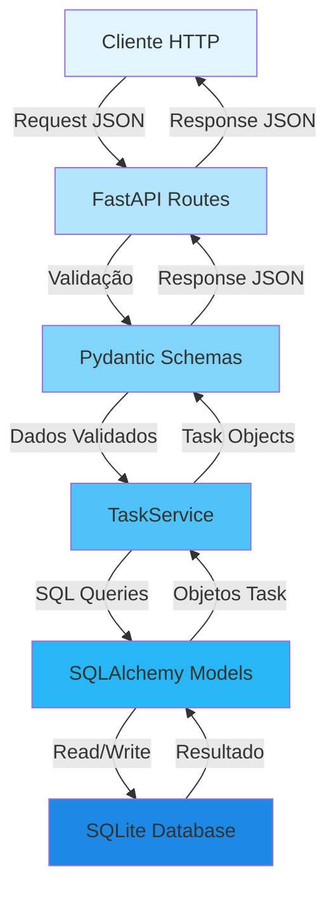
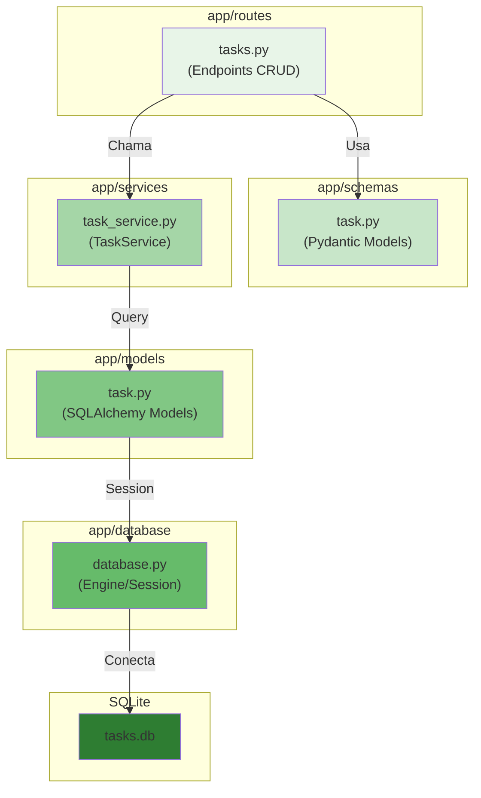
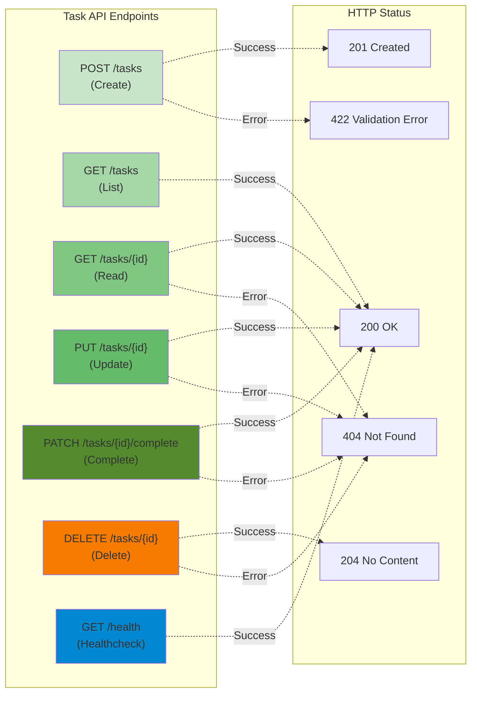

# Diagramas de Arquitetura — laboratorio-taskapi

Este documento contém diagramas Mermaid representando a arquitetura do sistema FastAPI com camadas de Routes, Services, Schemas e Models para persistência em SQLite.

## Diagrama de Fluxo de Dados (Requisição HTTP)

O diagrama abaixo ilustra o caminho de uma requisição HTTP desde o cliente até o banco de dados SQLite, passando pelas camadas da aplicação conforme estrutura definida no projeto.

### Fluxo de Persistência

1. **Request:** Cliente envia requisição HTTP com JSON
2. **Validação:** FastAPI Routes recebe e passa aos Schemas Pydantic para validação
3. **Processamento:** TaskService coordena lógica de negócio e chama modelos
4. **Persistência:** SQLAlchemy Models interagem com SQLite via ORM
5. **Resposta:** Dados retornam através das camadas em formato JSON validado

## Diagrama de Componentes

O diagrama de componentes mostra os pacotes do projeto e suas responsabilidades.

### Responsabilidades de Cada Camada

- **Routes** (`app/routes/tasks.py`): Define endpoints CRUD e delega para services
- **Schemas** (`app/schemas/task.py`): Validação de entrada/saída com Pydantic
- **Services** (`app/services/task_service.py`): Lógica de negócio (CRUD, filtros, paginação)
- **Models** (`app/models/task.py`): Entidades SQLAlchemy para mapeamento ORM
- **Database** (`app/database.py`): Configuração de engine e session SQLAlchemy

## Diagrama de Endpoints

O diagrama abaixo mostra os endpoints CRUD implementados no MVP.

