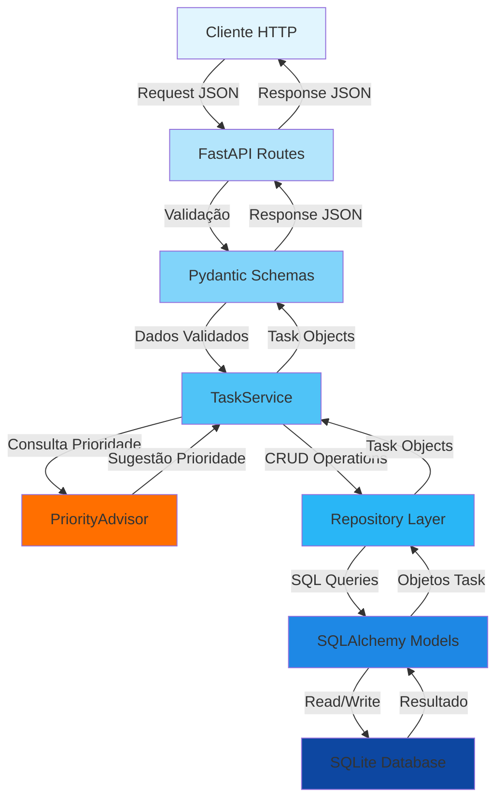
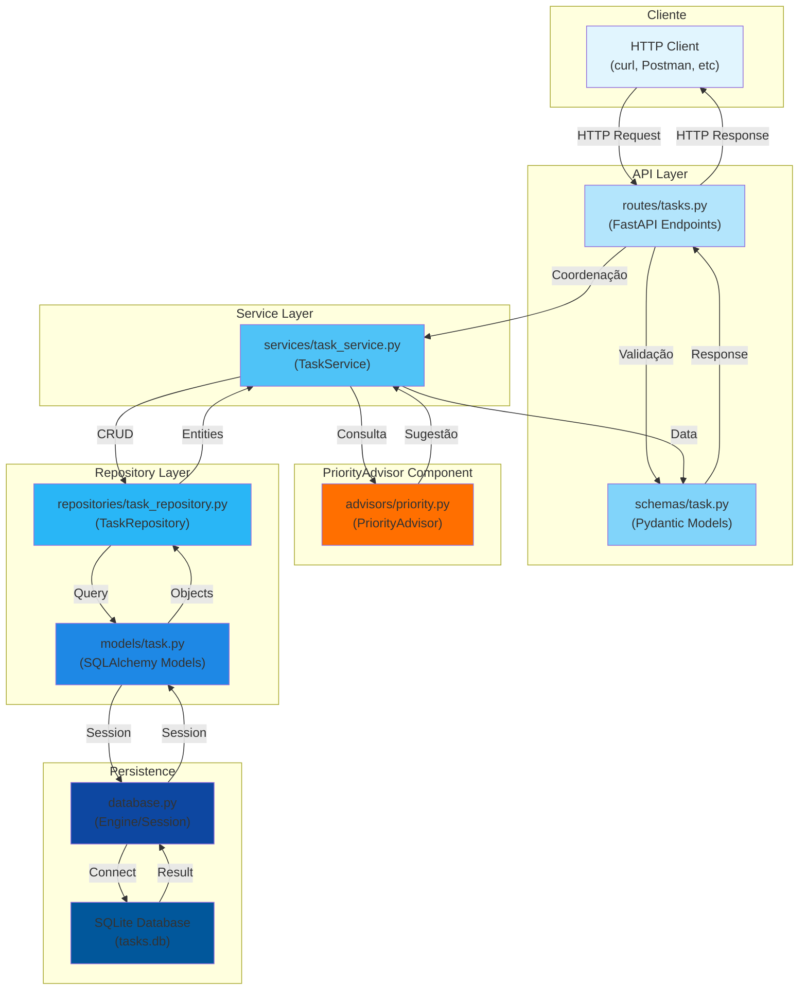
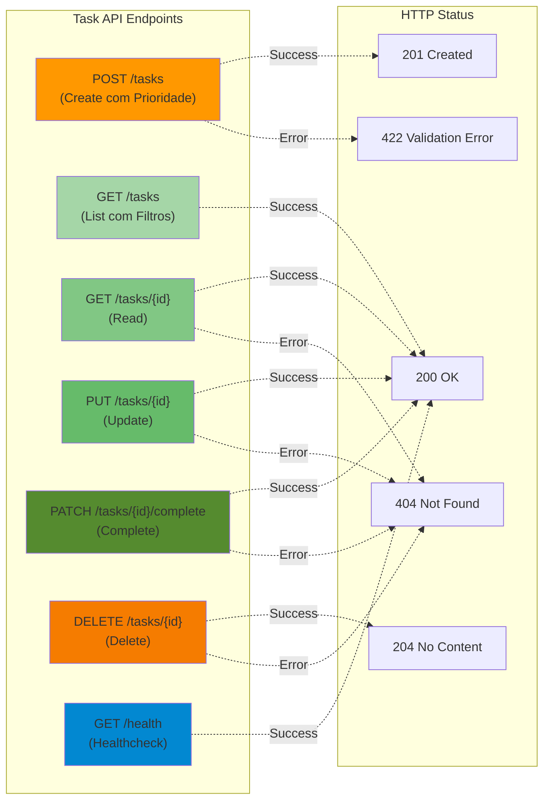

# Diagramas de Arquitetura — laboratorio-taskapi

Este documento contém diagramas Mermaid representando a arquitetura do sistema FastAPI com camadas API, Service, Repository e o componente de Priorização (PriorityAdvisor).

## Diagrama de Fluxo de Dados (Requisição HTTP)

O diagrama abaixo ilustra o caminho de uma requisição HTTP desde o cliente até o banco de dados SQLite, passando pelas camadas da aplicação.

### Fluxo de Persistência

1. **Request:** Cliente envia requisição HTTP com JSON
2. **Validação:** FastAPI Routes recebe e passa aos Schemas Pydantic para validação
3. **Processamento:** TaskService coordena lógica de negócio e consulta PriorityAdvisor
4. **Priorização:** PriorityAdvisor retorna sugestão de prioridade baseada em regras
5. **Persistência:** Repository Layer executa operações CRUD via SQLAlchemy Models
6. **Banco de Dados:** SQLite persiste dados
7. **Resposta:** Dados retornam através das camadas em formato JSON validado

## Diagrama de Componentes

O diagrama de componentes mostra as camadas arquiteturais: Cliente, API Layer, Service Layer, PriorityAdvisor e Repository Layer.

### Responsabilidades de Cada Camada

- **API Layer** (`routes/`, `schemas/`): Recebe requisições HTTP, valida com Pydantic e coordena com serviços
- **Service Layer** (`services/task_service.py`): Orquestra lógica de negócio, filtros, paginação e consulta PriorityAdvisor
- **PriorityAdvisor** (`advisors/priority.py`): Componente de priorização que sugere prioridades baseado em regras de negócio
- **Repository Layer** (`repositories/task_repository.py`): Abstrai operações CRUD e gerencia persistência
- **Models** (`models/task.py`): Entidades SQLAlchemy para mapeamento ORM
- **Database** (`database.py`): Configuração de engine e session SQLAlchemy

## Diagrama de Endpoints

O diagrama abaixo mostra os endpoints CRUD implementados no MVP com suporte a PriorityAdvisor.

### Integração com PriorityAdvisor

O endpoint `POST /tasks` é enriquecido pelo **PriorityAdvisor**, que:
- Analisa título, descrição e contexto da tarefa
- Retorna sugestão de prioridade (baixa, média, alta, crítica)
- A prioridade sugerida é retornada na resposta para o cliente validar